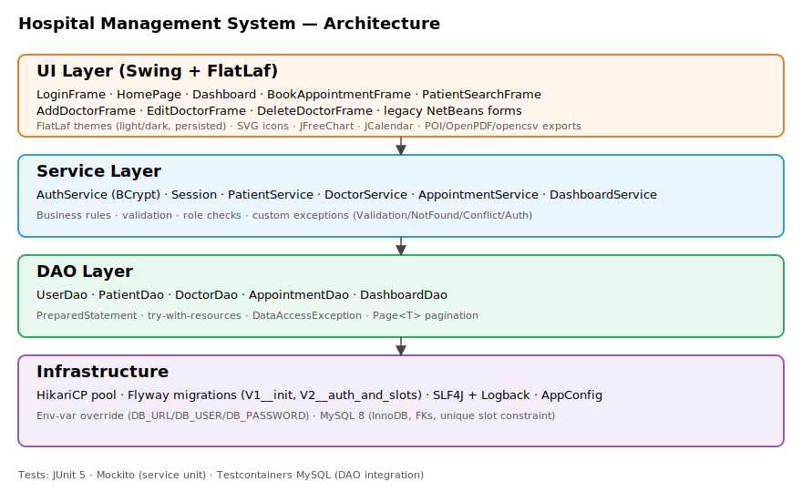

# Hospital Management System

A modern Java desktop application for managing patients, doctors, and appointments — built as a portfolio project that goes beyond the typical "JDBC inside button handlers" tutorial. It demonstrates layered architecture, real authentication, database migrations, dashboards, and exports.


## TL;DR — resume bullets

> Built a Java 17 / Swing hospital management app on a layered architecture (UI → Service → DAO → Hikari → MySQL) with **Flyway-managed schema**, **BCrypt-hashed authentication and role-based menus** (Admin / Doctor / Receptionist), **slot-based appointment scheduling** with database-enforced no-double-booking, **paginated & filtered search**, and one-click **CSV / Excel / PDF exports** (opencsv, Apache POI, OpenPDF). Modern UI via **FlatLaf** with a persistent light/dark theme toggle and an analytics **dashboard powered by JFreeChart**. Tested with **JUnit 5 + Mockito** for service logic and **Testcontainers + MySQL** for DAO integration.

## Screenshots

> Capture these on first run — see [`docs/screenshots/README.md`](docs/screenshots/README.md). The names below are referenced from this README.

| Login | Home | Dashboard |
|---|---|---|
|  |  |  |
| **Dark Home** | **Dark Dashboard** | **Search + Export** |
|  |  |  |
| **Book Appointment** | **Edit Doctor** | |
|  |  | |

## Architecture



```
UI (Swing + FlatLaf)
   │   LoginFrame → HomePage → { Dashboard, Doctor CRUD, Patient CRUD, BookAppointment, PatientSearch, … }
   ▼
Service layer
   │   AuthService (BCrypt) · Session · PatientService · DoctorService · AppointmentService · DashboardService
   │   ── validation, role checks, business rules (slot conflict, age range, etc.)
   ▼
DAO layer (PreparedStatement, try-with-resources, Page<T>)
   │   UserDao · PatientDao · DoctorDao · AppointmentDao · DashboardDao
   ▼
HikariCP pool → MySQL 8 (Flyway migrations: V1 schema, V2 auth + time slots)
```

## Feature highlights

- 🔐 **Authentication** — BCrypt-hashed passwords, `users` table, `Session` holder, login screen with show/hide password
- 👥 **Roles** — `ADMIN`, `DOCTOR`, `RECEPTIONIST` with role-gated menus and disabled buttons
- 🏥 **Doctor CRUD** — Add / Edit / Delete frames with combo-box pickers
- 📅 **Slot-based appointments** — `JDateChooser` calendar + dynamic slot dropdown that hides booked slots; DB enforces `UNIQUE(doctor_id, date, time)`
- 🔍 **Search with pagination** — Patient name `LIKE`, age range, doctor filter, prev/next page, total count
- 📊 **Dashboard** — KPI cards + JFreeChart line/bar/pie charts with theme-aware colors
- 🌗 **Light / dark theme** — FlatLaf Arc Orange / Arc Dark Orange, persisted to `~/.hms-theme`
- 📤 **Exports** — CSV (opencsv), Excel `.xlsx` (Apache POI), PDF (OpenPDF) — one menu, three formats
- 🗄 **Schema migrations** — Flyway V1 initial schema, V2 adds users + slot uniqueness; rerunning is safe
- 🪵 **Logging** — SLF4J + Logback, rolling file appender (`logs/hms.log`)
- 🧪 **Tests** — JUnit 5 unit tests with Mockito (service logic), Testcontainers integration test (DAO + real MySQL in Docker)

## Tech stack

| Concern | Library |
|---|---|
| UI | Swing + [FlatLaf](https://www.formdev.com/flatlaf/) (Arc Orange / Arc Dark Orange themes), FlatSVGIcon |
| Charting | [JFreeChart](https://www.jfree.org/jfreechart/) |
| Date picker | [JCalendar](https://github.com/toedter/jcalendar) |
| DB pool | [HikariCP](https://github.com/brettwooldridge/HikariCP) |
| Migrations | [Flyway](https://flywaydb.org/) |
| Auth | [jBCrypt](https://www.mindrot.org/projects/jBCrypt/) |
| Logging | [SLF4J](https://www.slf4j.org/) + [Logback](https://logback.qos.ch/) |
| Excel | [Apache POI](https://poi.apache.org/) |
| PDF | [OpenPDF](https://github.com/LibrePDF/OpenPDF) |
| CSV | [opencsv](https://opencsv.sourceforge.net/) |
| Tests | JUnit 5 · Mockito · AssertJ · Testcontainers |

## Getting started

### Prerequisites
- **Java 17** (Temurin/OpenJDK)
- **Maven 3.9+**
- **MySQL 8** running on `localhost:3306` (or override via env vars — see Security)
- *(Optional)* **Docker** if you want to run `mvn verify` (Testcontainers integration tests)

### 1. Create the database
```sql
CREATE DATABASE hospitalmanagementsystem CHARACTER SET utf8mb4;
```
> The schema itself is created automatically by Flyway on first launch.

### 2. Configure credentials (optional)
Defaults are in `src/main/resources/application.properties` (`root` / `root`). Override per-environment by setting env vars:
```bash
# Linux / macOS
export DB_URL='jdbc:mysql://localhost:3306/hospitalmanagementsystem?useSSL=false&serverTimezone=UTC&allowPublicKeyRetrieval=true'
export DB_USER='hms'
export DB_PASSWORD='change-me'
```
```powershell
# Windows PowerShell
$env:DB_URL='jdbc:mysql://localhost:3306/hospitalmanagementsystem?useSSL=false&serverTimezone=UTC&allowPublicKeyRetrieval=true'
$env:DB_USER='hms'
$env:DB_PASSWORD='change-me'
```

### 3. Build
```bash
mvn -DskipTests package
```

### 4. Run
```bash
mvn -q exec:java -Dexec.mainClass="com.mycompany.hospitalmanagementsystem.HospitalManagementSystem"
```

### 5. Login
| Field | Value |
|---|---|
| Username | `admin` |
| Password | `admin123` |

> **Change this password immediately on first login.** See the Security section.

## Tests

```bash
# Unit tests only (fast, no Docker needed)
mvn test

# Unit + integration tests (Testcontainers spins up MySQL in Docker)
mvn verify
```

Current state: 10 unit tests pass; integration test exercises insert / slot conflict / detail join against a real MySQL container.

## Security

This is a portfolio app, not a hardened production deployment. Before showing it anywhere with real data:

1. **Change the seeded admin password.** The Flyway V2 migration inserts `admin / admin123` so the app boots usable. After login, replace the bcrypt hash in `users` (or update the migration before deployment).
2. **Never run with `root/root`.** Set `DB_USER` / `DB_PASSWORD` env vars; `AppConfig` reads env first.
3. **Enable SSL on MySQL** and remove `useSSL=false` from `db.url`.
4. **Don't commit a customised `application.properties`** to a public fork — use env vars.

## Database

Full documentation lives in [`docs/database/`](docs/database/):

| File | Purpose |
|---|---|
| [`00_setup.sql`](docs/database/00_setup.sql) | One-time setup — creates the database and a dedicated app user |
| [`schema.sql`](docs/database/schema.sql) | Reference snapshot of the full schema (post-migrations) |
| [`er_diagram.svg`](docs/database/er_diagram.svg) | Entity-relationship diagram |
| [`er_diagram.txt`](docs/database/er_diagram.txt) | ASCII version of the diagram |

> The live schema is **owned by Flyway**. App startup applies migrations from `src/main/resources/db/migration/`. The files above are reference / docs only.

### Schema (managed by Flyway)

```
doctor(id, name, department, created_at, updated_at)
patient(id, name, age, doctor_id FK→doctor, created_at, updated_at)
appointment(id, patient_id FK→patient, doctor_id FK→doctor,
            appointment_date, appointment_time, notes,
            UNIQUE(doctor_id, appointment_date, appointment_time))
users(id, username UNIQUE, password_hash, role CHECK IN (ADMIN/DOCTOR/RECEPTIONIST),
      doctor_id FK→doctor, enabled, created_at)
```

The `UNIQUE(doctor_id, appointment_date, appointment_time)` index enforces "no double-booking" at the DB level — the service layer also pre-checks for a friendlier error message.

## Project layout

```
hospitalmanagement-system/
├── pom.xml
├── README.md
├── docs/
│   ├── architecture.svg
│   └── screenshots/
└── src/
    ├── main/
    │   ├── java/com/mycompany/
    │   │   ├── hms/
    │   │   │   ├── config/   AppConfig
    │   │   │   ├── db/       Database (Hikari) · Migrator (Flyway)
    │   │   │   ├── model/    Patient, Doctor, Appointment, AppointmentDetail,
    │   │   │   │             User, Role, Page<T>, PatientSearchCriteria
    │   │   │   ├── dao/      PatientDao, DoctorDao, AppointmentDao,
    │   │   │   │             UserDao, DashboardDao, DataAccessException
    │   │   │   ├── service/  Patient/Doctor/Appointment/Auth/Dashboard + Session
    │   │   │   ├── exception/Validation/NotFound/Conflict/Auth
    │   │   │   ├── util/     Validators · Exporters
    │   │   │   └── ui/       LoginFrame, Dashboard, ThemeManager, Icons,
    │   │   │                 BookAppointmentFrame, PatientSearchFrame,
    │   │   │                 Add/Edit/DeleteDoctorFrame, UiErrors
    │   │   └── hospitalmanagementsystem/   ← bootstrap + legacy NetBeans forms
    │   └── resources/
    │       ├── application.properties · logback.xml
    │       ├── icons/*.svg
    │       └── db/migration/V1__init_schema.sql · V2__auth_and_slots.sql
    └── test/java/com/mycompany/hms/
        ├── service/   AppointmentServiceTest, PatientServiceTest (Mockito)
        └── dao/       AppointmentDaoIT (Testcontainers)
```

> The `com.mycompany.hospitalmanagementsystem` package keeps the original NetBeans-generated `.form` JFrames so the form designer keeps working. New code lives under `com.mycompany.hms.*`. The `BookAppointmentFrame` and `PatientSearchFrame` (under `hms.ui`) replace the legacy `GetAppointment` and `SearchPatient` screens; the rest of the legacy forms are still used and just delegate to services.

## Roadmap

Already shipped:

- ✅ Tier 1 — layered architecture, pool, migrations, logging, tests
- ✅ Tier 2 — auth, roles, doctor CRUD, slot scheduling, search/pagination, exports
- ✅ Tier 3 — FlatLaf, light/dark, dashboard with charts

Coming next:

- ⏳ Tier 4 — Docker + docker-compose, GitHub Actions CI, JaCoCo coverage, optional Spring Boot REST split
- ⏳ Tier 5 — AI symptom checker, QR appointment slips, email reminders

## Acknowledgements

Forked & extended from the original [hospitalmanagement-system](.) tutorial project. Original UI mock-ups, layout, and `.form` files by Rohi Deshmukh; everything under `com.mycompany.hms.*` plus the migrations, dashboard, login, and tests are new.

## License
MIT (or whatever you prefer — pick one before publishing).
